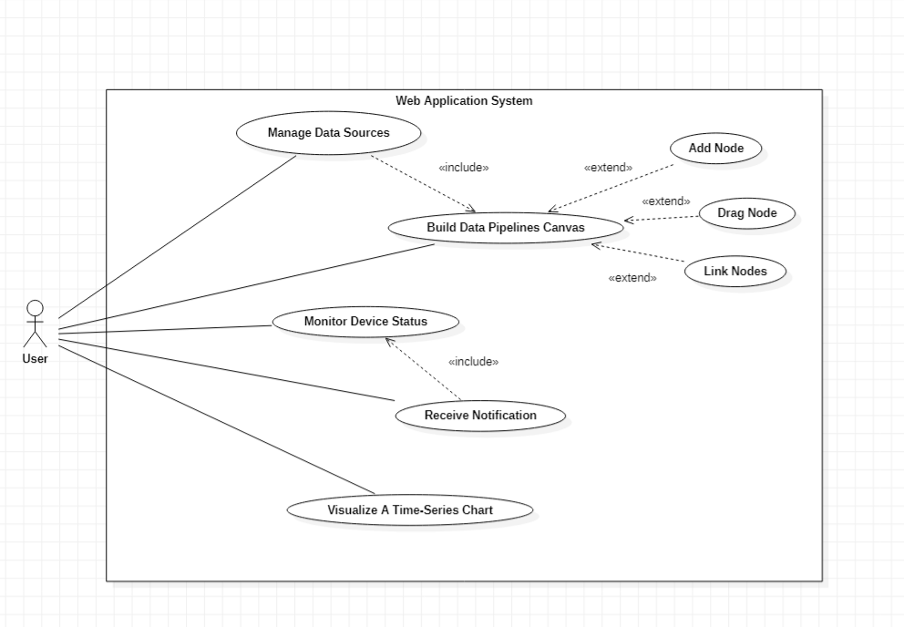
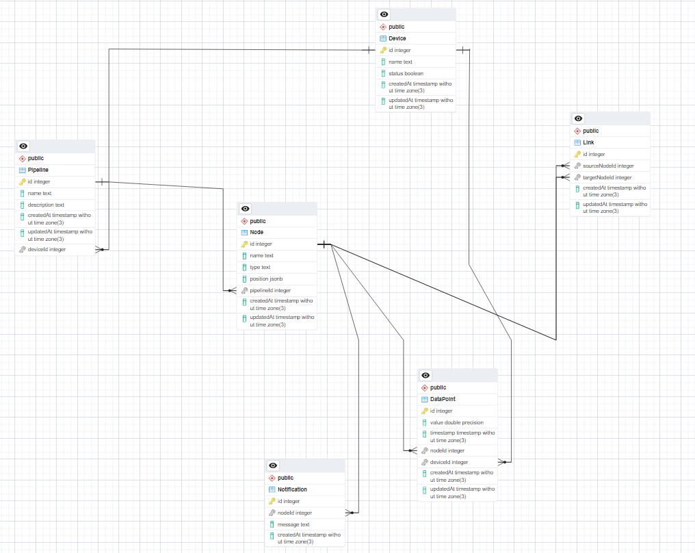

# take-home-challenge
Doing full-stack assignment:

## Techstack

Back-end: NodeJS with Express, Typescript, Prisma ORM, Swagger (Api Documentation)

Front-end: React, Typescript, React-Flow , TailwindCSS, CharJS, Axios, Socket.IO, Redux

## Requirements

 

### 1. Manage Data Sources
- **Description**: Allows users to add, remove, and modify data sources for data pipelines.
- **Related Use Cases**: Includes `Build Data Pipelines Canvas`.

### 2. Build Data Pipelines Canvas
- **Description**: Provides a drag-and-drop interface to design data pipelines.
- **Related Use Cases**: 
  - Extends: `Add Node`, `Drag Node`, `Link Nodes`.

### 3. Monitor Device Status
- **Description**: Enables users to monitor the operational status of connected devices.
- **Related Use Cases**: Includes `Receive Notification`.

### 4. Receive Notification
- **Description**: Sends notifications to users when specific events (e.g., device failure) occur.

### 5. Visualize a Time-Series Chart
- **Description**: Allows users to visualize data trends over time using time-series charts.

## Key Features

- **Device Management**: Create, update, and track the status of devices.
- **Data Points Monitoring**: Collect and store data points from devices and nodes.
- **Graph-based Node Management**: Visualize nodes (sensors, data processors, etc.) and edges (data flows) using a canvas-based diagram system.
- **Real-time Notifications**: Receive alerts and notifications for device and node statuses in real time.
- **Data Visualization**: View time-series data on the dashboard using graphs and charts.

## Diagram 

 

## API Endpoints

### Devices

- `GET /api/devices`: Retrieve all devices.
- `POST /api/devices`: Create a new device.
- `PUT /api/devices/:id`: Update device details.
- `DELETE /api/devices/:id`: Remove a device.

### Nodes

- `GET /api/nodes`: Retrieve all nodes.
- `POST /api/nodes`: Create a new node.
- `PUT /api/nodes/:id`: Update node details.
- `DELETE /api/nodes/:id`: Remove a node.

### Links

- `GET /api/links`: Retrieve all edges.
- `POST /api/links`: Create a new edge.
- `DELETE /api/links/:id`: Remove an edge.

### DataPoints

- `GET /api/dataPoints`: Retrieve all data points.
- `POST /api/dataPoints`: Create a new data point for a device and node.

### Notifications

- `GET /api/notifications`: Retrieve all notifications.
- `POST /api/notifications`: Create a new notification for a node.

### Notes

Due to only 3 days of development, there's still much things for improvement and additional features to be implemented. It may not fully meet all the requirements yet, but the process has been an invaluable learning experience, and I have given my best effort throughout its development.
